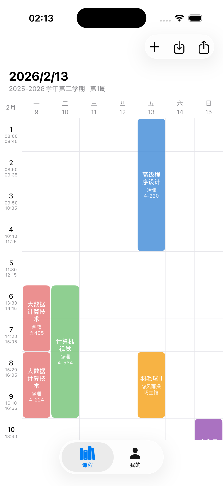

# MySchedule 📚

iOS 课程表应用，专为大学生设计。支持从正方教务系统导入课表，也可手动添加课程。

## 功能

- **课表周视图** — 左右滑动切换周次，自动定位当前周
- **教务系统导入** — 内嵌 WebView 登录正方教务系统（V-9.0），一键提取课表数据
- **多学期管理** — 创建多个学期，独立存储课程数据，自由切换
- **课程编辑** — 点击色块查看详情，可修改名称、教师、颜色、时间安排
- **手动添加** — 支持手动录入课程信息
- **上课时间自定义** — 可调整每日节数和各节次起止时间
- **日历导出** — 导入系统日历（EventKit）或导出为 .ics 文件

## 截图

<p align="center">
  
</p>

## 技术栈

- **SwiftUI** + **SwiftData**
- iOS 17.0+
- Xcode 16.0+
- 项目生成：[XcodeGen](https://github.com/yonaskolb/XcodeGen)

## 构建

```bash
# 安装 XcodeGen（如未安装）
brew install xcodegen

# 生成 Xcode 项目
cd MySchedule
xcodegen generate

# 打开项目
open MySchedule.xcodeproj
```

## 项目结构

```
Sources/
├── App/                    # App 入口
│   └── MyScheduleApp.swift
├── Models/                 # 数据模型
│   ├── Models.swift        # Course, CourseSchedule, SemesterConfig
│   └── CourseColor.swift   # 预定义颜色调色板
├── Services/               # 服务层
│   ├── ScheduleParser.swift    # 正方教务系统 HTML 解析
│   ├── CalendarExporter.swift  # 日历导出
│   └── TrustAllCerts.swift     # SSL 证书信任处理
└── Views/                  # 视图
    ├── ScheduleView.swift          # 课表主视图
    ├── ImportView.swift            # WebView 导入页
    ├── CourseDetailView.swift      # 课程详情与编辑
    ├── AddCourseView.swift         # 手动添加课程
    ├── ProfileView.swift           # 个人设置 & 学期管理
    ├── SectionTimeSettingView.swift # 上课时间设置
    ├── MainTabView.swift           # 底部 Tab 栏
    └── Components/
        └── CourseBlockView.swift   # 课程色块组件
```

## 许可证

MIT License
